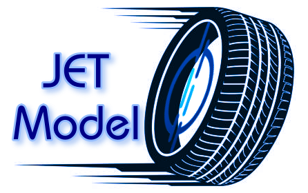

# JET Model (Jedha Evaluation Tyres)



[](http://forthebadge.com) [](https://forthebadge.com)


This project aims to help users to maintain tyres of their vehicles, It is based on deep learning using image classification:

🚨🛞Tyre quality control by image:
* Good condition (fit to drive) ✅
* Bad condition (not fit to drive) ❌

There is 6% of fatal accidents in France & Europe due to a bad quality of tyres, a bad maintaining.

sources : 
https://www.lesaviezvous.net/societe/les-pneus-en-mauvais-etat-sont-directement-responsables-de-15-des-accidents-mortels.html
https://www.liguedesconducteurs.org/paroles-d-experts/le-mauvais-etat-des-pneumatiques-est-responsable-de-6-des-accidents-mortels-en-europe-chaque-annee

There is also a pollution and health problem with that. According to a study conducted by the British laboratory Emissions Analytics, the fine particles emitted by tire wear are 2,000 times more numerous than those emitted by exhaust pipes, reports The Guardian (https://www.theguardian.com/environment/2022/jun/03/car-tyres-produce-more-particle-pollution-than-exhausts-tests-show). These tire particles, which pollute the air, water, and soil, contain numerous toxic components, including carcinogens.

sources :
https://www.geo.fr/environnement/une-etude-conclut-que-les-pneus-de-nos-voitures-polluent-bien-plus-que-le-gaz-dechappement-210346

An help with maintaining could reduce these problems. Moreover we can imagine things further. We can imagine use the model in sensors in the car, that can take pictures of tyre and send the result of tyre’s quality into the dashboard of the 
car

## Getting Started

* Here you can find the model testing in this [Notebook](Models/Models.ipynb).

* The links for the saving models are the following, on Huggong face:

https://huggingface.co/HyraXuna/JET_model_inceptionV3_base/tree/main

https://huggingface.co/HyraXuna/Jet_model_MobileNetV2/tree/main

* In the folder Dashboard, You will find all the files for the creation of the application.

* Some test for image processing, with the idea to generalize prediction on bigger images of full wheel that can be recognize and after that cut in multiples sub-images with only the tyre to make predictions on all the different parts of the tyre.

### Prerequisites

Things you need to run the codes:

```
python 3.10.11

streamlit==1.32.0
plotly==5.22.0
Pillow
pandas==2.2.2
numpy==1.26.4
datasets
scikit-image
seaborn
matplotlib
tensorflow==2.19.0
ultralytics
opencv-python-headless
huggingface_hub

```

### Application

Link for the App : https://huggingface.co/spaces/jedhajet/jedhaJetTer

the different pages of the App:

* The prediction with image loading. A global prediction for the entire wheel and the different prediction for each boxes cut in the principal image

* The overview of the project

* The dataset presentation with some other informations

* The model presentation and performances, Baseline & Final one

  
## Authors

**Youenn Patat** - [Github Account](https://github.com/HyraXuna)

&

**Floriane Dussart** - [Github Account](https://github.com/flo2706)

## Acknowledgments

* Thanks To Floriane Dussart for her help and the team working.

* Thanks for Jedha and its instructors for the lectures, exercises and all the work.


